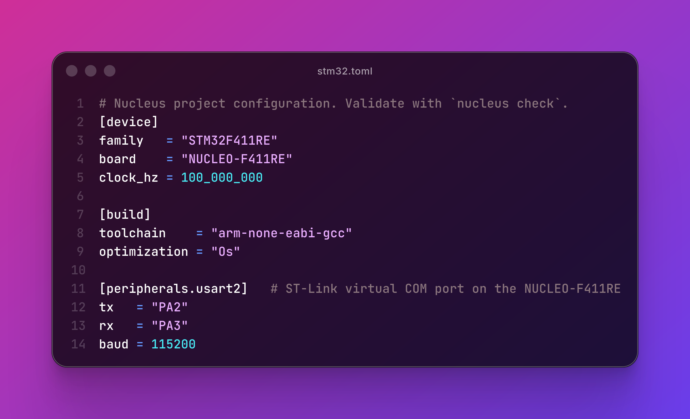

# Nucleus

https://github.com/harshverma27/nucleus/raw/main/media/nucleus-brag.mp4



> A CLI-first STM32 developer platform: declarative hardware configuration,
> a constraint solver that actually understands silicon, dual-backend
> hardware-in-the-loop testing, and real-time trace debugging.

**Not an IDE replacement. A developer platform.**

Nucleus replaces STM32CubeIDE's two real lock-ins:

1. Graphical pin/peripheral configuration that produces opaque, un-diffable XML.
2. Integrated debug/trace/test tooling with no open-source, CI-friendly equivalent.

Everything lives in one version-controlled file, `stm32.toml`, validated and
driven entirely from the CLI — usable from any editor, gatable in CI, with VS
Code as an optional thin client on top.

📖 **[Read the docs](https://heyharsh.me/nucleus/)**
· **[Watch the demo video](https://youtu.be/8zDZzE12wec)**

---

## Table of Contents

- [What Nucleus Is](#what-nucleus-is)
- [Quick Start](#quick-start)
- [Features](#features)
  - [Verify — the constraint solver](#verify--the-constraint-solver)
  - [Prove — dual-backend hardware-in-the-loop testing](#prove--dual-backend-hardware-in-the-loop-testing)
  - [Observe — trace, history, CI](#observe--trace-history-ci)
  - [Crown — lockstep co-execution](#crown--lockstep-co-execution)
- [Architecture](#architecture)
- [The `stm32.toml` Format](#the-stm32toml-format)
- [CLI Reference](#cli-reference)
- [Workspace Layout](#workspace-layout)
- [Tech Stack](#tech-stack)
- [Architectural Rules](#architectural-rules-do-not-violate)
- [Contributing](#contributing)
- [License](#license)

---

## What Nucleus Is

Three products inside one ecosystem, all owned by the Rust CLI:

| Product | What it does |
|---|---|
| Hardware-aware build system | `stm32.toml` → validated HAL init code → CMake project |
| Hardware-in-the-loop test runner | declarative + scripted tests, run on a QEMU twin and/or real silicon, with sim↔silicon divergence detection |
| Embedded observability stack | ITM packet decoder → WebSocket → real-time React dashboard, plus a test-history view |

Two MCUs are supported end-to-end: **STM32F446RE** and **STM32F411RE**
(NUCLEO-F446RE / NUCLEO-F411RE).

---

## Quick Start

```sh
# Install
cargo install nucleus-cli
# …or from source: cargo install --git https://github.com/harshverma27/nucleus nucleus-cli --locked

# Scaffold a project
nucleus init --board NUCLEO-F446RE
cd my-project

# Validate, build, flash
nucleus check
nucleus build
nucleus flash
```

Full walkthrough: **[Installation](https://heyharsh.me/nucleus/installation.html)**
· **[Quickstart: Blink an LED](https://heyharsh.me/nucleus/quickstart.html)**
· **[CLI Usage](https://heyharsh.me/nucleus/cli.html)**.

---

## Features

Nucleus's feature set splits into four pillars — the same structure the
[docs site](https://heyharsh.me/nucleus/) uses.

### Verify — the constraint solver

`nucleus check` parses `stm32.toml` and validates it against a real silicon
model, deterministically generated from ST's own pack data:

| Check | What it catches |
|---|---|
| [Pinout & peripheral verification](https://heyharsh.me/nucleus/pinout-verification.html) | pin collisions, AF mismatches, invalid/missing pins, disabled clock domains, peripherals unavailable on the selected family |
| [Clock-tree solver](https://heyharsh.me/nucleus/clock-tree.html) | PLL divider/VCO legality, prescaler legality, and silicon frequency limits (APB1 ≤ 45 MHz, APB2 ≤ 90 MHz, SYSCLK/AHB ≤ 180 MHz on F446) |
| [DMA arbitration](https://heyharsh.me/nucleus/dma-arbitration.html) | two peripherals silently fighting for the same DMA1/DMA2 stream |
| [IRQ / NVIC verifier](https://heyharsh.me/nucleus/irq-verifier.html) | unhandled NVIC vectors, shared EXTI line collisions, DMA-vs-IRQ priority inversion |
| [Constraint auto-router](https://heyharsh.me/nucleus/auto-router.html) | `nucleus route` — declare a peripheral instance with no pins assigned, get a complete, valid, deterministic pinout back |

`nucleus check` exits non-zero on any conflict — the same exit code CI gates
on. The CMSIS pack XML never has DMA/clock/IRQ data, so those models are
hand-maintained and cross-checked against ST's reference manuals (RM0390 for
F446RE, RM0383 for F411RE).

### Prove — dual-backend hardware-in-the-loop testing

`nucleus test` runs `[[test]]` blocks against **two backends behind one
trait** — QEMU (always available, no hardware needed) and real silicon over
SWD/SWO:

- [Dual-backend HIL substrate](https://heyharsh.me/nucleus/hil-backends.html) — the `Backend` trait both implementations share, and the empirically-confirmed QEMU fidelity gap (no GPIO model, full USART2 model) every test author should know about.
- [Declarative tests](https://heyharsh.me/nucleus/declarative-tests.html) — one-line assertions (`"pin PA5 toggles at 1Hz ±5%"`, `"USART2 echoes \"ping\" within 10ms"`, `"trace event \"boot\" within 500ms"`) with no host code.
- [Scripted tests](https://heyharsh.me/nucleus/scripted-tests.html) — a real on-device test-agent + host SDK, for assertions too stateful for one line.

A backend with no available tool (no QEMU binary, no probe attached) is
reported as **skipped**, never as a failure — a hosted CI runner with no
board stays green for the legs it can't exercise.

### Observe — trace, history, CI

- [Trace dashboard & ITM decoding](https://heyharsh.me/nucleus/itm-trace.html) — a zero-panic, fuzz-tested ARM CoreSight ITM/SWO decoder, streamed over WebSocket to a React/Canvas dashboard (log lines + live variable charts), embeddable in VS Code or a standalone browser.
- [Test history & CI](https://heyharsh.me/nucleus/test-history.html) — every `nucleus test` run appends to `tests/test_history.json`; `nucleus history`/`nucleus show` read it back, the dashboard renders it as a bar chart, and a reusable GitHub composite action posts a per-backend PR summary.

### Crown — lockstep co-execution

[Lockstep co-execution](https://heyharsh.me/nucleus/lockstep.html) —
`nucleus lockstep` runs the *same firmware* on both backends at once,
collects an ITM-checkpointed observation trace from each, and reports the
first point where simulator and silicon disagree. This is the system's
answer to "passing on QEMU only proves your logic is correct in an idealized
model" — divergence at a checkpoint is the signal that a timing assumption,
register quirk, or simulator fidelity gap is hiding a real bug.

---

## Architecture

```
nucleus CLI  (Rust — owns all logic)
    │
    ├── constraint solver        parse stm32.toml → verify pin/clock/DMA/IRQ → emit C
    │       └── LSP server       diagnostics + hover over the language server protocol
    │
    ├── HIL test runner          Backend trait → QEMU + hardware backends → declarative/scripted tests
    │       └── lockstep         run both backends on one firmware, diff their observation traces
    │
    ├── ITM trace daemon         read SWO from OpenOCD → decode CoreSight packets → WebSocket
    │
    └── build orchestrator       invoke CMake + arm-none-eabi-gcc + st-flash

VS Code Extension  (TypeScript — thin UI layer only)
    ├── LSP client               talks to nucleus lsp, shows squiggles in editor
    └── Webview panel            embeds the React trace + history dashboard
```

**The CLI owns everything. The extension is a display layer.** This means CI
works without VS Code installed, a future JetBrains/Neovim client needs only
a new thin client (not a rewrite), and the hard logic lives in one place,
tested independently.

---

## The `stm32.toml` Format

```toml
[device]
family   = "STM32F446RE"
board    = "NUCLEO-F446RE"
clock_hz = 180_000_000

[clocks]
source         = "pll"
pll_source     = "hse"
pll_m = 8
pll_n = 360
pll_p = 2
apb1_prescaler = 2
apb2_prescaler = 1

[peripherals.usart2]
tx = "PA2"
rx = "PA3"
baud = 115200
dma  = true          # opt in to DMA arbitration
irq  = true           # opt in to NVIC-vector verification

[peripherals.spi1]
mosi = "PA7"
miso = "PA6"
sck  = "PA5"
nss  = "PA4"

[peripherals.tim2]    # no pins assigned — `nucleus route` fills them in
channel1 = ""

[[exti]]
pin = "PA0"

[trace]
enabled  = true
swo_freq = 2_000_000

[[trace.variables]]
name = "temperature"
port = 1
type = "f32"

[[test]]
name      = "uart_echo"
assertion = "USART2 echoes \"ping\" within 10ms"
backend   = "both"
```

Fully version-controllable, diffable, and reviewable in PRs — "PA5 moved
from SPI1 to SPI2" is a one-line `git diff`.

---

## CLI Reference

| Command | What it does |
|---|---|
| `nucleus init` | Scaffold a new project (`stm32.toml`, `CMakeLists.txt`, `src/main.c`, CI workflow). `--board NUCLEO-F446RE` (default) or `NUCLEO-F411RE`. |
| `nucleus check` | Validate `stm32.toml` against the full constraint database; print conflicts; exit non-zero on any. |
| `nucleus route` | Auto-assign pins for peripherals declared without them; write a fully-specified config. |
| `nucleus build` | Run CMake + arm-none-eabi-gcc; emit `firmware.elf`/`.bin`. |
| `nucleus flash` | Program the board via `st-flash`/OpenOCD. |
| `nucleus test` | Run `[[test]]` assertions on the QEMU twin and/or real hardware. `--backend qemu\|hardware`, `--test <name>`. |
| `nucleus lockstep` | Run both backends on the same firmware; report the first sim↔silicon divergence. `--explain` (reserved for v3). |
| `nucleus history` | List recorded test runs with pass/fail counts. `--graph` for the dashboard JSON, `--last N` to limit. |
| `nucleus show [run]` | Every assertion result for one run (defaults to the latest). |
| `nucleus trace` | Start the ITM daemon + dashboard. |
| `nucleus lsp` | Start the language server (spawned by the VS Code extension, not run by hand). |

Full flag reference: **[CLI Usage](https://heyharsh.me/nucleus/cli.html)**.

---

## Workspace Layout

```
nucleus/
├── crates/
│   ├── nucleus-cli/          # binary — command dispatch
│   ├── nucleus-compiler/     # TOML parser, constraint solver, codegen, router, assertions
│   ├── nucleus-db/           # STM32 constraint database: pin/AF (pack-generated) + clock/DMA/IRQ models (hand-maintained)
│   ├── nucleus-lsp/          # tower-lsp server wrapping nucleus-compiler
│   ├── nucleus-itm/          # zero-dependency, never-panic ITM/CoreSight decoder
│   ├── nucleus-trace/        # OpenOCD telnet + WebSocket server
│   ├── nucleus-hil/          # Backend trait, QEMU + hardware backends, lockstep comparator
│   ├── nucleus-history/      # tests/test_history.json read/write
│   └── nucleus-test-sdk/     # device test-agent host SDK (scripted tests)
├── extension/                 # VS Code client (TypeScript) + React dashboard
├── tests/fixtures/            # sample stm32.toml files for integration tests
├── .github/actions/nucleus/   # reusable composite CI action
└── docs/                      # mdBook documentation source
```

---

## Tech Stack

| Layer | Technology | Why |
|---|---|---|
| CLI + compiler + LSP + ITM + HIL | Rust | memory safety, speed, one cargo workspace |
| Constraint database source | STM32 CMSIS Packs (pin/AF, pack-generated) + hand-maintained clock/DMA/IRQ models (RM-cited) | pin/AF has an official machine-readable source; clock/DMA/IRQ don't, so they're hand-verified |
| HIL simulator backend | QEMU (`qemu-system-arm -M netduinoplus2`) | always available in CI, no hardware needed |
| HIL hardware backend | OpenOCD + SWD/SWO | works with the on-board ST-Link, no extra probe |
| Language server protocol | `tower-lsp` | async LSP server framework |
| ITM packet decoding | hand-rolled Rust (ARM CoreSight spec) | no existing crate covers this correctly |
| WebSocket server | `tokio-tungstenite` | async, integrates with the tokio runtime |
| VS Code extension host | TypeScript | required by the VS Code extension API |
| Dashboard | React + Canvas API | Canvas for high-frequency live chart rendering |
| Build system | CMake + arm-none-eabi-gcc | standard embedded toolchain |
| CI | GitHub Actions | reusable composite action, per-backend PR summary |

---

## Architectural Rules (do not violate)

1. **The extension contains zero business logic.** Any constraint checking, decoding, or validation belongs in the Rust CLI.
2. **Codegen does not reimplement the HAL.** Generated `nucleus_init.c` calls only stock `HAL_*_Init` functions with resolved parameters — ST HAL updates don't break Nucleus.
3. **Two target MCUs: F446RE + F411RE.** Both supported end-to-end. No new families without a deliberate decision to expand.
4. **Local tool only.** No cloud registry, no upload features.
5. **Lockstep has no explanation engine, by design.** It reports *where* two backends diverge, not *why* — root-cause inference is deferred past v2.

---

## Contributing

Contributions are welcome — see [`CONTRIBUTING.md`](CONTRIBUTING.md) for the
build/test workflow and the architectural rules above. Run `make check` (the
exact CI gate) before pushing. Changes ship with tests.

## License

Dual-licensed under either of

- Apache License, Version 2.0 ([`LICENSE-APACHE`](LICENSE-APACHE))
- MIT license ([`LICENSE-MIT`](LICENSE-MIT))

at your option. Unless you explicitly state otherwise, any contribution
intentionally submitted for inclusion in the work by you shall be
dual-licensed as above, without any additional terms or conditions.

---

*Target hardware: NUCLEO-F446RE + NUCLEO-F411RE.*
